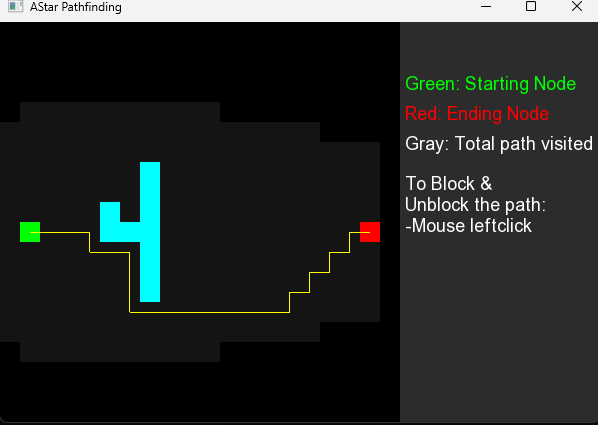
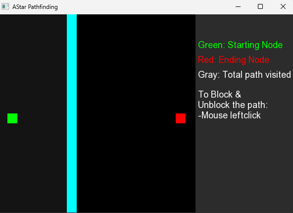

# Pathfinding Visualization

## Project Description

Pathfinding Visualization is a C++ application using SFML (Simple and Fast Multimedia Library) to visualize the A* pathfinding algorithm. The application allows users to interactively block and unblock paths and see the algorithm in action.

 
<br>
when the path can be found it looks for all the option dark gray is all the possible path covered
<br>
 
<br>
if the path is blocked than it cannot goes to the final destination
<br>

## Features

- Visualize the A* pathfinding algorithm.
- Block and unblock paths using mouse clicks.
- Different colors to represent the starting node, end node, and visited paths.

## Installation

Follow these steps to set up and run the project on your device:

1. **Clone the Repository:**

   Open a terminal and run:

   ```bash
   git clone https://github.com/Bishmit/PathFinding-Visualization-using-Astar-algorithm.git
   cd PathFinding-Visualization-using-Astar-algorithm
Install Dependencies:

Ensure that SFML is installed on your system. Follow the installation instructions for your operating system:

On Windows: Download and install SFML from the SFML website.

On MacOs
```
brew install sfml
```
On Linux
```
sudo apt-get install libsfml-dev
```
Create a Build Directory:
```
mkdir build
cd build
```

Configure the Project with CMake:
```
cmake ..
```

Build the Project:
```
cmake --build .
```

Run the Executable:
```
./Pathfinding
```

