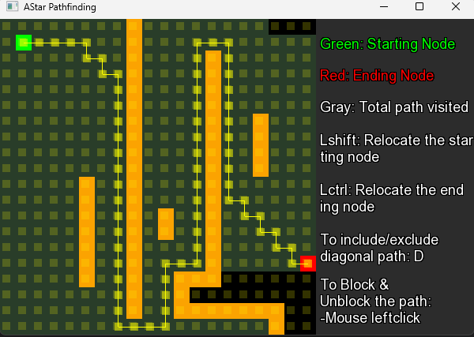

# Pathfinding Visualization

## Project Description

Pathfinding Visualization is a C++ application using SFML (Simple and Fast Multimedia Library) to visualize the A* pathfinding algorithm. The application allows users to interactively block and unblock paths and see the algorithm in action.

When the path can be found, it explores all the possible paths. Dark gray represents all the possible paths covered by the A* algorithm. Use the **Mouse Left Click** to place obstacles between the start and end nodes.

 

We can adjust the nodes as desired, and the path will update in real-time with **LShift + Mouse Left Click** and **LCtrl + Mouse Left Click**.

  

You can also include diagonal paths by pressing **D**, allowing the search to occur diagonally in eight directions.

 

If all possible paths are blocked, the algorithm cannot reach the final destination.

 

## Features

- Visualize the A* pathfinding algorithm.
- Block and unblock paths using mouse clicks.
- Different colors represent the starting node, end node, and visited paths.
- Can Search Diagonally and non-Diagonally on Runtime. 

---

## Installation

1. **Clone the Repository:**

   Open a terminal and run:

   ```bash
   git clone https://github.com/Bishmit/PathFinding-Visualization-using-Astar-algorithm.git
   cd PathFinding-Visualization-using-Astar-algorithm
Install Dependencies:

Ensure that SFML is installed on your system. Follow the installation instructions for your operating system:

On Windows: Download and install SFML from the SFML website.

On MacOs
```
brew install sfml
```
On Linux
```
sudo apt-get install libsfml-dev
```
Create a Build Directory:
```
mkdir build
cd build
```

Configure the Project with CMake:
```
cmake ..
```

Build the Project:
```
cmake --build .
```

Run the Executable:
```
./Pathfinding
```

